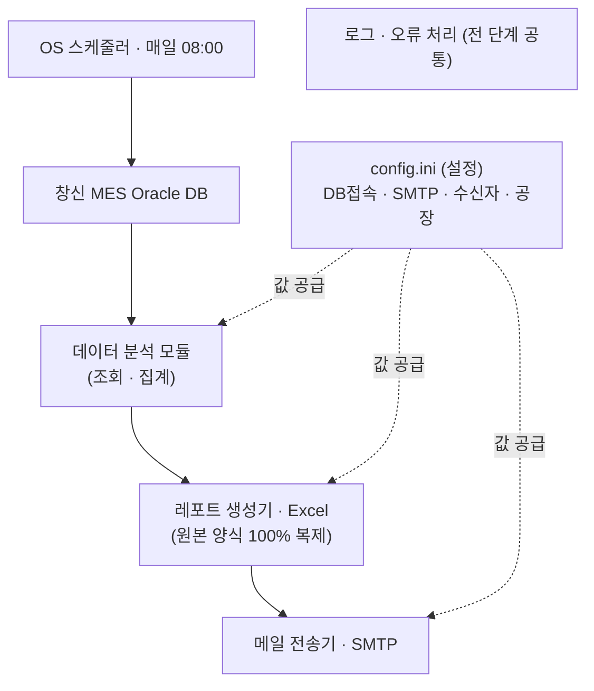

# CS-MES · BALANCE OUTGOING 일일 자동발송

창신 MES(Oracle DB)에서 **밑창 미드솔(IP·PH) + 아웃솔(OS)의 "출고 부족분(BALANCE OUTGOING)"** 을
조회하여 **원본 엑셀 리포트와 똑같은 양식**으로 만들어 **메일로 발송**합니다.

**두 가지 사용 경로가 있습니다:**
- 🅰 **Claude Desktop (권장·현직자용)** — 챗에 "오늘 outgoing 리포트 보내줘" 한마디. 로컬 MCP 서버 + sqlcl + Zapier로 동작. **터미널·SMTP·월렛 비번 불필요.** → 아래 0장.
- 🅱 **무인 서버/스케줄러** — 순수 Python(SMTP)으로 매일 08:00 자동발송. → 1장 이하.

---

## 0. Claude Desktop에서 쓰기 (권장)

DB 접속은 Claude Desktop에 이미 연결된 **sqlcl MCP**(자동로그인 월렛)가 맡고,
**리포트 생성 MCP 서버**(`report_only_mcp.py`)가 원본 양식 엑셀만 만듭니다(메일 발송 안 함).
발송은 **Zapier(Gmail)** 로 합니다. → python-oracledb·월렛 비번·Instant Client·SMTP 전부 불필요.


**MCP 서버 3개 툴:** `outgoing_query_plan`(날짜창 SQL) · `build_outgoing_report`(sqlcl 결과→엑셀) · `make_demo_report`(DB 없이 데모).

**설치 (1회):**

```bash
# (1) 리포트 생성기용 가상환경 + 라이브러리 (DB 불필요: openpyxl, mcp 만)
cd "$HOME/Library/CloudStorage/OneDrive-postech.ac.kr/CS-MES/balance_outgoing_mailer"
rm -rf .venv && python3 -m venv .venv
.venv/bin/python -m pip install -q --upgrade pip
.venv/bin/python -m pip install -q openpyxl mcp
```

**(2) Claude Desktop에 MCP 서버 등록** — 설정 → 개발자 → 설정 편집(`claude_desktop_config.json`)에 추가:

```json
{
  "mcpServers": {
    "balance-outgoing": {
      "command": "/Users/nicklee/Library/CloudStorage/OneDrive-postech.ac.kr/CS-MES/balance_outgoing_mailer/.venv/bin/python",
      "args": ["/Users/nicklee/Library/CloudStorage/OneDrive-postech.ac.kr/CS-MES/balance_outgoing_mailer/report_only_mcp.py"]
    }
  }
}
```

**(3) Claude Desktop 재시작** → sqlcl·Zapier도 연결돼 있으면 끝. 챗에 **"오늘 outgoing 리포트 만들어서 메일 보내줘"** 하면:
`query_plan → sqlcl 실행 → build_outgoing_report(엑셀 `report/` 저장) → Zapier Gmail 발송(요약+공유링크)` 순으로 진행됩니다.

> 리포트는 OneDrive `report/` 폴더에 쌓이고, 메일 본문엔 공유 링크(`config.ini [report] share_link`)가 들어갑니다.

---

## 1. 동작 흐름 (Workflow) — 무인 서버 경로(SMTP)



순서: **스케줄러가 깨움 → DB 조회 → 부족분 집계 → 엑셀 생성 → 메일 발송**.
모든 설정값은 `config.ini` 한 곳에서 공급되고, 전 단계는 로그(`balance_outgoing.log`)로 기록됩니다.

---

## 2. 빠른 시작 (3단계)

```bash
# (1) 필요 라이브러리 설치  ※ Python 3.9+
pip install oracledb openpyxl

# (2) 비밀번호 1회 저장 (메일/DB) — 이후 다시 묻지 않음
python3 balance_outgoing_mailer.py --setup

# (3) 한 줄 실행 — 조회 → 엑셀 → 메일 발송
python3 balance_outgoing_mailer.py
```

### 필요 라이브러리

| 라이브러리 | 용도 | 비고 |
|---|---|---|
| `oracledb` | Oracle DB 접속 | **Thin 모드** — Oracle Client(Instant Client) 설치 불필요 |
| `openpyxl` | 엑셀(.xlsx) 생성 | 양식 템플릿 읽기 + 리포트 작성 |

> `--test-mail`(메일만 점검)은 라이브러리 없이 Python 표준 기능만으로도 동작합니다.

### 자주 쓰는 명령

```bash
csmes --setup              # 비밀번호 1회 입력·저장
csmes --doctor             # 라이브러리·월렛·DB·SMTP·템플릿 일괄 점검 (✅/❌)
csmes --install-schedule   # 매일 08:00 자동 실행 등록 (해제: --uninstall-schedule)
csmes --test-mail          # DB 없이 메일 전송만 점검
csmes --dry-run            # 엑셀만 생성(발송 X)
csmes --date 2026-06-23    # 특정 날짜로 다시 생성·발송
csmes                      # 전체 실행 (평소 이 한 줄)
csmes --version            # 버전 표시
```

> `csmes` 별칭이 없으면 `python3 balance_outgoing_mailer.py [옵션]` 으로 동일하게 동작합니다.
> 자동 실행이 실패하면 원인을 담은 **실패 알림 메일**이 수신자에게 발송되고, DB/SMTP 일시 오류는 **자동 재시도(최대 3회)** 합니다.

**한 단어 별칭(선택)** — 어느 폴더에서나 `csmes` 로 실행:

```bash
echo 'alias csmes="python3 $HOME/Desktop/CS-MES/balance_outgoing_mailer/balance_outgoing_mailer.py"' >> ~/.zshrc
source ~/.zshrc
# 이후: csmes  /  csmes --test-mail  /  csmes --dry-run
```

> 비밀번호는 첫 실행 때 **숨김 입력 → `config.ini`에 저장(파일권한 600)** 됩니다.
> 저장돼 있지 않은데 스케줄러(비대화형)로 실행되면 멈추지 않고 즉시 안내 후 종료하니, **스케줄 걸기 전 `--setup`을 꼭 1회** 실행하세요.

---

## 3. ⚠️ 아직 DB에 없는(빈칸으로 출력되는) 항목

원본 리포트에는 있으나 **현재 우리 Oracle DB(OCI)에는 데이터가 없어** 아래 칸은 **빈칸**으로 나옵니다.
나머지 항목은 모두 정상 출력됩니다. 추후 소스가 확보되면 코드의 `color_specs()` / `scan_di_ckp()`
**한 곳만** 채우면 자동 반영되도록 설계해 두었습니다.

| 빈칸(데이터 없음) | 설명 |
|---|---|
| **COLOR** | 제품 컬러웨이 — 색상 마스터 미보유 |
| **IP SPRAY (BEM)** | 미드솔 스프레이 색상 스펙 — 소스 미발견 |
| **PAD PRINTING (BEP)** | 패드 프린팅 색상 스펙 — 소스 미발견 |
| **SCAN DI CKP** | DI 체크포인트 스캔 — 현재 스캔 데이터에 DI 식별자 없음 |

> ✅ 정상 출력: PLANT(동) · ITEM CLASS · LINE · MODEL · STYLE · GEN · 일자버킷(D+3~D-7, 색상강조) · TOTAL · GRAND TOTAL · SCAN BEM/BEP

---

## 4. 현재 구현 상태

| 워크플로우 단계 | 상태 | 비고 |
|---|---|---|
| 창신 MES Oracle DB 접속 | ✅ 완성 | `db_connect()` — 월렛(OCI)·직접DSN 둘 다, `--test-db` 점검 |
| 데이터 분석 모듈 (조회·집계) | ✅ 완성·검증 | 미출고 판정·일자버킷·피벗. **단** COLOR / IP SPRAY / PAD PRINTING / SCAN DI CKP 는 DB에 데이터 없어 빈칸(hook 대기) |
| 레포트 생성기 (Excel) | ✅ 완성 | 원본 양식 100% 복제(템플릿 방식) |
| 메일 전송기 (SMTP) | ✅ 완성·검증 | `send_mail()` — TLS + 첨부. **Gmail 테스트 발송 성공** |
| config.ini (설정) | ⚙️ 진행중 | SMTP·수신자 입력완료, **DB 접속(dsn·월렛·계정) 미입력** |
| 로그/오류 처리 | ✅ 완성 | 파일로그 + 단계별 try/except + **실패 알림 메일** + **자동 재시도(3회)** |
| OS 스케줄러 (08:00 발송) | ✅ 자동등록 | `csmes --install-schedule` 한 줄(해제 `--uninstall-schedule`). 대상 PC에서 1회 |

---

## 5. 설정 파일 (`config.ini`)

`config.ini.example` 를 복사해 `config.ini` 를 만들고 값만 채우면 됩니다 (비밀번호는 `--setup`이 채워줌).

```ini
[db]
user            = ADMIN
password        =                          ; --setup 으로 저장(직접 입력 불필요)
dsn             = changshinincaipoc_medium ; 월렛=TNS별칭 / 직접접속=host:port/service
wallet_dir      = /경로/wallet             ; 월렛 zip 푼 폴더 (직접접속이면 비움)
wallet_password =

[smtp]
host     = smtp.gmail.com    ; 사내 서버면 그 주소
port     = 587
use_tls  = true
user     = moon081588@gmail.com
password =                   ; --setup 으로 저장
from     = moon081588@gmail.com

[report]
plants        = 3110,3120,3210
window_before = 3            ; D+3
window_after  = 7            ; D-7
recipients    = a@x.com, b@y.com   ; 받는사람(쉼표로 여러 명)
```

> 실제 `config.ini`(비밀번호 포함)는 `.gitignore` 로 커밋 제외됩니다.

---

## 6. 매일 아침 8시 자동 실행

> 먼저 `--setup` 으로 비밀번호를 1회 저장해 두세요.

### macOS / Linux (cron)
```bash
crontab -e
0 8 * * * cd /경로/balance_outgoing_mailer && /usr/bin/python3 balance_outgoing_mailer.py >> cron.log 2>&1
```

### Windows (작업 스케줄러)
```cmd
schtasks /create /tn "BalanceOutgoing" /tr "python C:\경로\balance_outgoing_mailer.py" /sc daily /st 08:00
```

---

## 7. 구성 파일

| 파일 | 설명 |
|---|---|
| `balance_outgoing_mailer.py` | 본체(조회 → 엑셀 → 메일) |
| `report_template.xlsx` | **원본 양식 템플릿** — 반드시 같은 폴더에 둘 것 |
| `legend.png` | 상단 색상범례 이미지 — 반드시 같은 폴더에 둘 것 |
| `config.ini` | 설정(접속·수신자). `--setup`이 비번 저장 |
| `balance_outgoing.log` | 실행 로그(자동 생성) |
| `BALANCE_OUTGOING_YYYYMMDD.xlsx` | 생성된 리포트(자동 생성) |

> `.py` · `report_template.xlsx` · `legend.png` **세 파일은 항상 함께** 배포하세요. (템플릿/범례가 없으면 실행 오류)

---

## 8. 집계 규칙 (요약)

미출고 부족분 = 다음 조건의 패스카드 실적:
`OUT_DATE='19991231'`(미출고) · `PROD_MOVE_TYPE='PROD'` · `END_ROUTING_YN='Y'` ·
시트별 등급 **IP**(II·IP) / **PH**(PH·PP·CP) / **OS**(OS) · 마감그룹(`CLOSING_YN='Y'`) 제외.
일자버킷은 작업일(일요일 제외) 기준 **D+3 … DD … D-7**.
